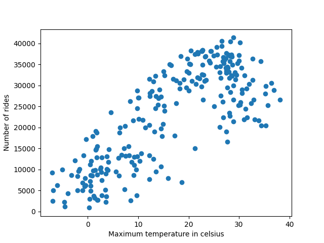
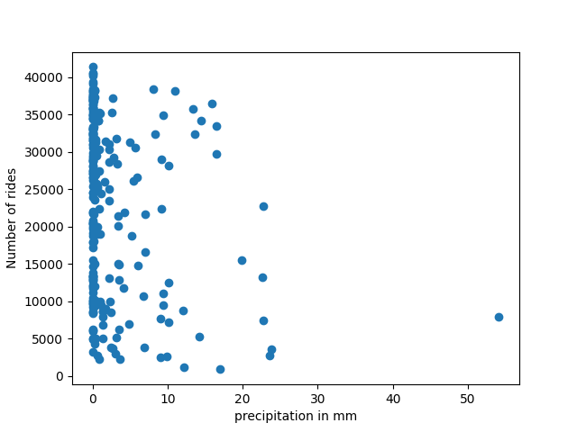

This report is a description and interpretation of the code run in `analyse_data.py`
We only investigate the per day and station aggregated data. 
Lets look at the (maximum- ) temperature first in the plot

It seems consistent with the natural expectation, that the bike usuage increases 
with temperature until it gets too hot (around 3 Degree Celsius ).
This plot also suggests, that naivly putting this into a linear model is not a good idea, 
as the turning point at high temperatures adds some nonlinearity.
Lets look at the precipation

This is not super easy to interpret. Lets try out some binary feature instead (plus a weekday 
feature:
```
df["is_weekday"] = pd.to_datetime(df['date']).dt.dayofweek < 5
df["precipitation"] = df["prcp"] != 0.0
```
On this features, plus OneHotEncoded-Stations we fit a Poisson regression (see code for details)
Lets look at the coefs:
```
                 coef  exp
precipitation   -0.23  0.8
is_weekday       0.11, 1.11
```
(Not really surprisingly) precipitation lowers the count. Interestingly, 
on weekdays the count is a bit higher this might indicate, that the customers use the 
bikes mostly for going to work.   
If we trust these numbers we can report management, that on days with rain they can expect 
20% lower ride shares.

ToDos (e.g):

1.Add temperature to regression (maybe bin the data) 

2.Look at the per ride data (not used so far) and investigate the tripduration 
    and the weather


